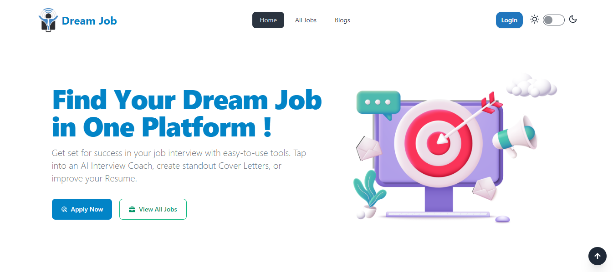

<h1 align="center">Dream Job </h1>

<p align="center">
  
</p>
<br>

Live Server: [Dream-Job-Client](https://dream-job-36fe2.web.app/)

Server Repo Link: [Dream-Job-Server-Repo](https://github.com/younusFoysal/Dream-Job-Server)

## Features: 
* User can Login with Google account.
* User can Add, Update, Delete Job.
* User can Apply for Jobs.
* User can Search by Job Title.
* User can view jobs by job category
* User see the applied Jobs List.


Implemented JWT routes:
```
https://dream-job-36fe2.web.app/myjobs/
https://dream-job-36fe2.web.app/appliedjobs
```


Installed Npm Packages:
```
@tanstack/react-query
@react-pdf/renderer
axios
Firebase
framer-motion
Moment
Localforage
match-sorter
prop-types
react
react-dom
react-icons
react-hook-form
react-router-dom
react-toastify
react-tooltip
react-query
react-tabs
react-simple-typewriter
react-syntax-highlighter
react-to-pdf
sort-by
sweetalert2
daisyui
postcss
tailwindcss
vite
react-helmet-async
```

